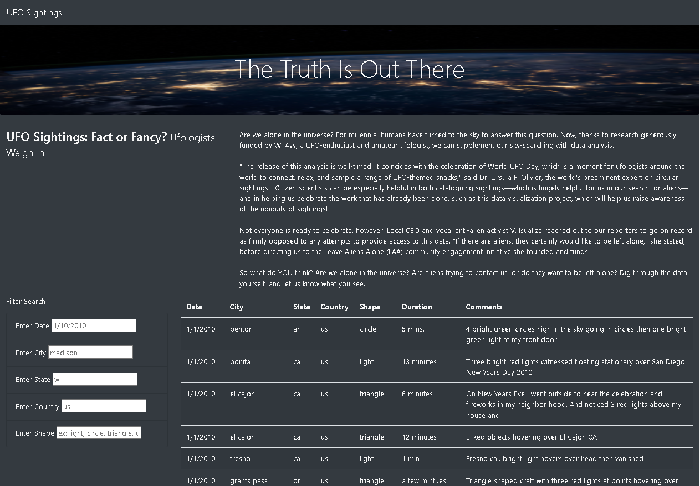
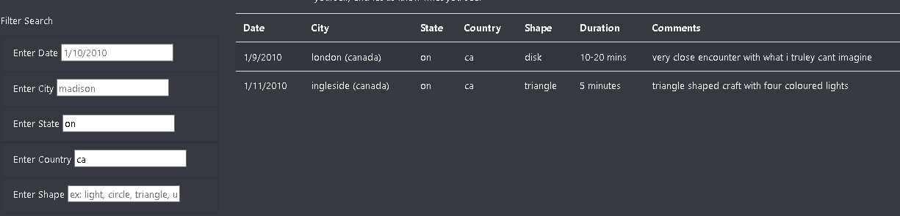

# UFOs

## I. Overview of Project

### Background
Dana wants to showcase her hometown that's famous for UFO sightings. She works on a JS file of UFO sightings data, and presents the information in a dynamic table in her webpage.

### Objective
Dana’s webpage and dynamic table are working as intended, but she’d like to provide a more in-depth analysis of UFO sightings by allowing users to filter for multiple criteria at the same time. In addition to the date will be table filters for the city, state, country, and shape.

## II. [Results](index.html)

The **dynamic table on the right** will change and only show **relevant data** according to inputs typed on the **filter 
parameters on the left.** 

We can filter data using only one  or more of the parameters (Date, City, State, Country, Shape). Shown below is an example of sightings filtered using Ontario (state) and Canada (Country).

## III. Summary

The summary addresses one drawback of this webpage (2 pt)

The summary addresses two additional recommendations for further development (4 pt)
